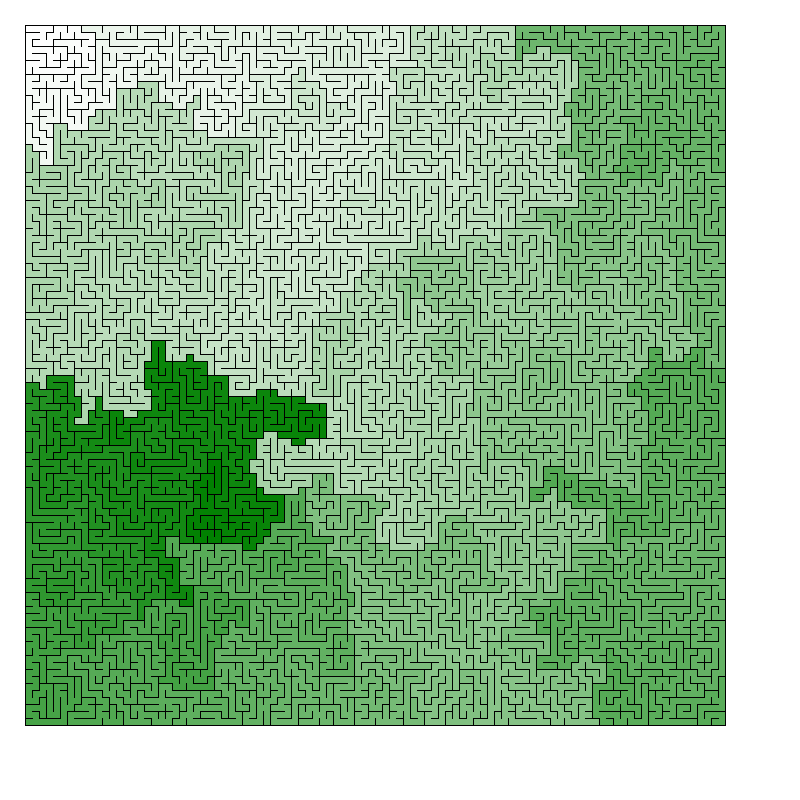
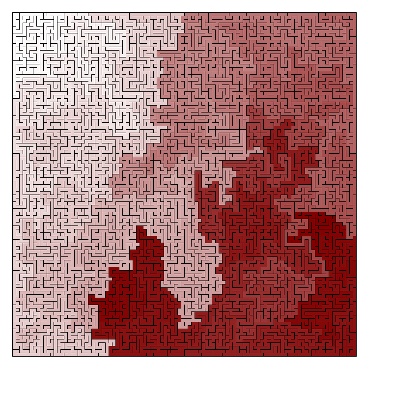
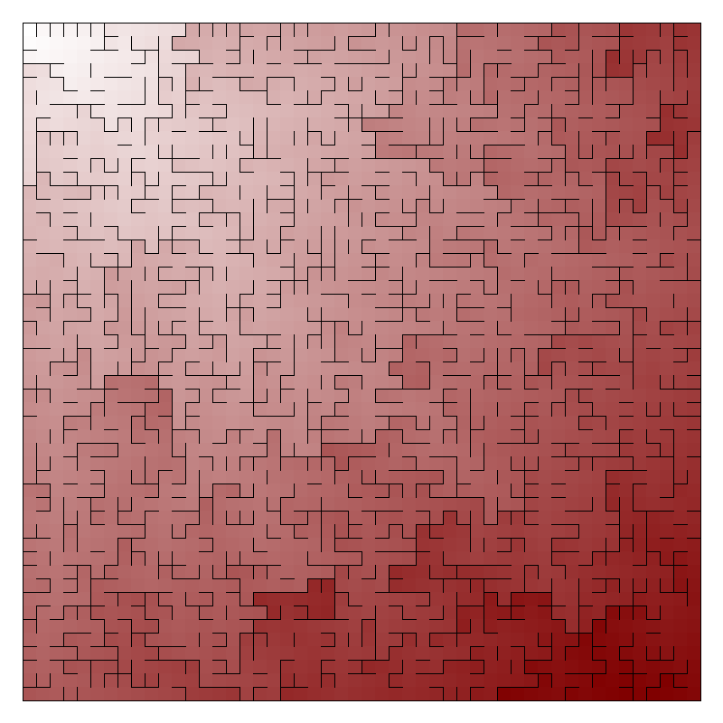
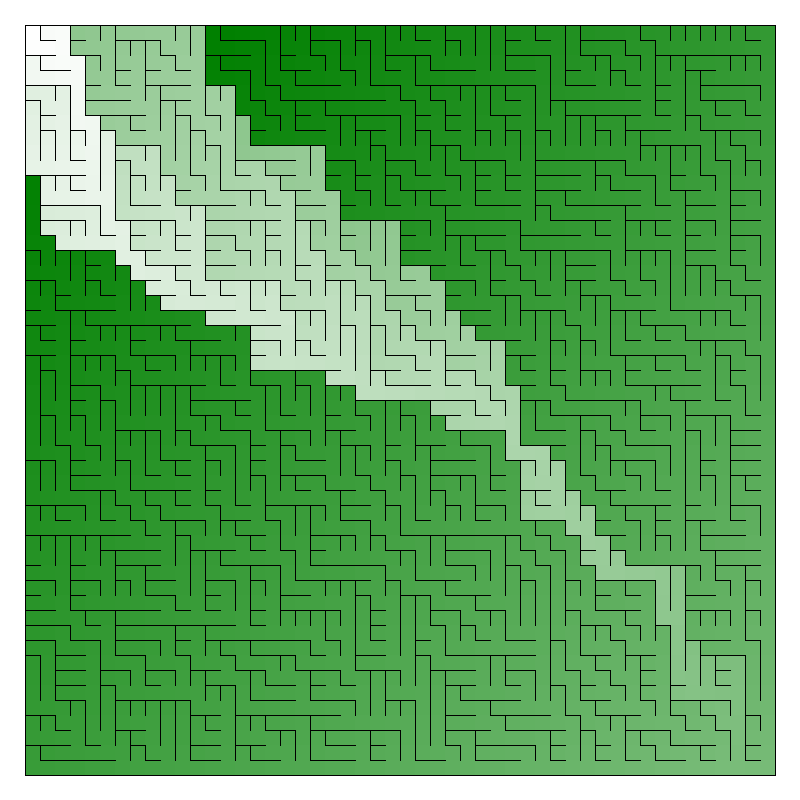

# Maze Algorithms
Python implementation for various maze generation algorithms from the book [Mazes for Programmers](http://www.mazesforprogrammers.com/). 
I did this a while ago so there's a couple of places where I haven't done things _exactly_ as I would if I was to 
rewrite everything now. The book is a great resource so pick it up if you want some interesting reading.

## Running
In the repo are implementations for four algorithms:

* Recursive Backtracking
* Aldous-Broder
* Hunt and Kill
* Binary Tree

They can be run with `python3 <algoname>.py`. To change the parameters such as the maze dimensions just edit the 
`__main__` section at the end of each file. There are two ways to draw the mazes, [matplotlib](https://matplotlib.org/)
 (which is the default) and [pillow](https://python-pillow.org/). Both can be installed using `pip`. The pillow backend allows coloring of the different cells
 based on distance from the origin(Top Left).

## Example output

## Hunt and Kill 100x100

## Recursive Backtracking 100x100

## Hunt and Kill 100x100

## Aldous-Broder 50x50

## Wilson's 50x50

## Binary Tree 50x50 South East Bias

